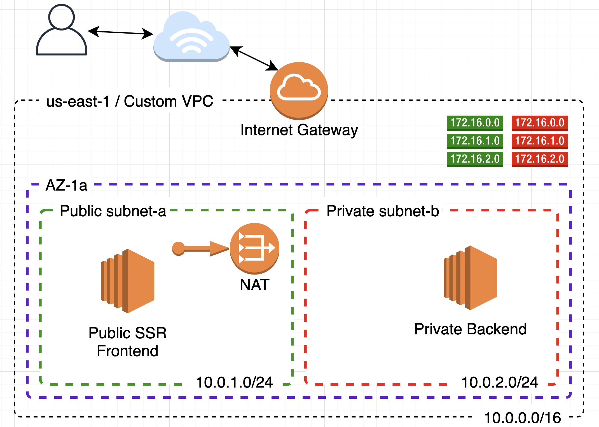
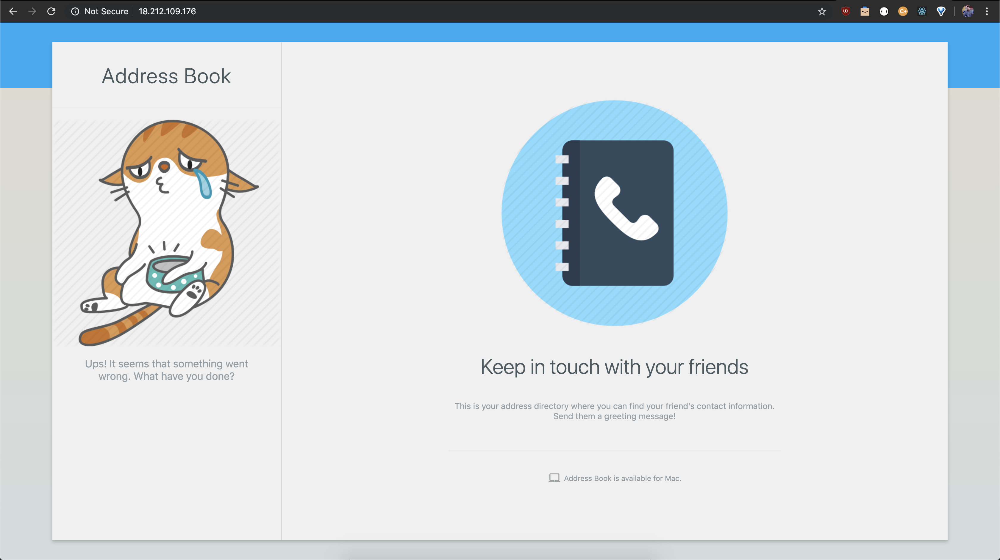

# Tutorial: Implement a Custom VPC with private and public subnets

This tutorial will teach you how to create a custom VPC from scratch and secure your backends services while keeping public services available for everyone.

## Architecture



## Workflow

There're two subnets inside the same Availability Zone (`AZ-1a`). `subnet-a` is public (has internet access) while `subnet-b` is private.

`subnet-a` is public because it has associated a Route Table which routes traffic from the subnet to the internet through the Internet Gateway (from `0.0.0.0/0` to IGW).

`subnet-b` is private because it does not have internet acces by its own, instead it uses a NAT Gateway (Network Address Translator). What the NAT Gateway does is, whenever an instance inside the private subnet wants to reach iternet, the traffic is routed to the NAT device, which acts imposter, lending it's public IP (Elastic IP) to reach internet through the IGW. When the response goes back, the NAT device route back it to the original requester. So, there's a Route Table associated with the `subnet-b` which makes it private, routing traffic that wants to reach internet to the NAT device (from `0.0.0.0/0` to NAT). Notice that the NAT Gateway must be inside the public subnet so it is able to hit internet.

And as you have already inferred, there's also an Internet Gateway attached to the VPC, enabling internet access.

There's an EC2 instance in the public subnet with a Server Side Rendered (SSR) React App, developed using [Next.js](https://nextjs.org/) which hits an API hosted in another EC2 inside the private subnet. This API only has one Endpoint to retrieve a static list of users.

## App Example

## Prerequisites

This tutorial asumes you have an AWS account and you've configured AWS credentials for CLI, if you haven't [please do so](https://docs.aws.amazon.com/cli/latest/userguide/cli-chap-install.html#post-install-configure).

I have configured the CLI to use the `us-east-1` region, so all the resources will be created in this region.

To follow the procedures in this tutorial you'll need a command line terminal to run commands. Commands are shown as below:

```
(bash) $ command
----------------
output
```

`(bash) $ ` is a constant indicating that is a command running in bash. Everything below `--------------` is the output of the command, or if the response is a JSON, it will have its own section denoted by **Output:** header.

> **IMPORTANT!** Make sure to replace ID parameters in all the AWS commands.

Let's start.

## Creating a Custom VPC

A VPC is an isolated portion of the AWS cloud populated by AWS objects, such as Amazon EC2 instances. It is basically a network in the cloud. You must specify an IPv4 address range for your VPC. Specify the IPv4 address range as a Classless Inter-Domain Routing (CIDR) block; for example, 10.0.0.0/16. You cannot specify an IPv4 CIDR block larger than /16. You can optionally associate an Amazon-provided IPv6 CIDR block with the VPC.

```
create-vpc
  --cidr-block <value>
  [--amazon-provided-ipv6-cidr-block | --no-amazon-provided-ipv6-cidr-block]
  [--dry-run | --no-dry-run]
  [--instance-tenancy <value>]
  [--cli-input-json <value>]
  [--generate-cli-skeleton <value>]
```

```bash
(bash) $ aws ec2 create-vpc \
    --cidr-block 10.0.0.0/16
```

Output:

```json
{
  "Vpc": {
    "VpcId": "vpc-0d655eeb1089e10ff",
    "InstanceTenancy": "default",
    "Tags": [],
    "CidrBlockAssociationSet": [
      {
        "AssociationId": "vpc-cidr-assoc-0d312e44950988d81",
        "CidrBlock": "10.0.0.0/16",
        "CidrBlockState": {
          "State": "associated"
        }
      }
    ],
    "Ipv6CidrBlockAssociationSet": [],
    "State": "pending",
    "DhcpOptionsId": "dopt-0c363277",
    "OwnerId": "436887685341",
    "CidrBlock": "10.0.0.0/16",
    "IsDefault": false
  }
}
```

> When you create a VPC, also a Network Access Control List (NACL), a Security Group (SG) and a Route Table (RT) are created with default configurations.

## Creating subnets

A subnet us a portion of your network (your VPC).

In an on-premise architecture it is common to design subnets based on departments and functionalities (ie. finances, HR, marketing, each of them with its own subred).

But in cloud it's used to design according to what should be public and what private. Backend services should be isolated from internet and only enable access from known sources. By doing this we keep our services secure from unintended access.

When you create each subnet, you provide the VPC ID and IPv4 CIDR block for the subnet. After you create a subnet, you can't change its CIDR block. The size of the subnet's IPv4 CIDR block can be the same as a VPC's IPv4 CIDR block, or a subset of a VPC's IPv4 CIDR block. If you create more than one subnet in a VPC, the subnets' CIDR blocks must not overlap. The smallest IPv4 subnet (and VPC) you can create uses a /28 netmask (16 IPv4 addresses), and the largest uses a /16 netmask (65,536 IPv4 addresses).

If you add more than one subnet to a VPC, they're set up in a star topology with a logical router in the middle.

```
create-subnet
  [--availability-zone <value>]
  [--availability-zone-id <value>]
  --cidr-block <value>
  [--ipv6-cidr-block <value>]
  --vpc-id <value>
  [--dry-run | --no-dry-run]
  [--cli-input-json <value>]
  [--generate-cli-skeleton <value>]
```

```bash
(bash) $ aws ec2 create-subnet \
    --availability-zone us-east-1a \
    --vpc-id vpc-0d655eeb1089e10ff \
    --cidr-block 10.0.1.0/24
```

Output:

```json
{
  "Subnet": {
    "MapPublicIpOnLaunch": false,
    "AvailabilityZoneId": "use1-az6",
    "AvailableIpAddressCount": 251,
    "DefaultForAz": false,
    "SubnetArn": "arn:aws:ec2:us-east-1:436887685341:subnet/subnet-035ea7e7fb6ddcf78",
    "Ipv6CidrBlockAssociationSet": [],
    "VpcId": "vpc-0d655eeb1089e10ff",
    "State": "pending",
    "AvailabilityZone": "us-east-1a",
    "SubnetId": "subnet-035ea7e7fb6ddcf78",
    "OwnerId": "436887685341",
    "CidrBlock": "10.0.1.0/24",
    "AssignIpv6AddressOnCreation": false
  }
}
```

```bash
(bash) $ aws ec2 create-subnet \
    --availability-zone us-east-1a \
    --vpc-id vpc-0d655eeb1089e10ff \
    --cidr-block 10.0.2.0/24
```

Output:

```json
{
  "Subnet": {
    "MapPublicIpOnLaunch": false,
    "AvailabilityZoneId": "use1-az6",
    "AvailableIpAddressCount": 251,
    "DefaultForAz": false,
    "SubnetArn": "arn:aws:ec2:us-east-1:436887685341:subnet/subnet-04fc9f2d0dc7d8577",
    "Ipv6CidrBlockAssociationSet": [],
    "VpcId": "vpc-0d655eeb1089e10ff",
    "State": "pending",
    "AvailabilityZone": "us-east-1a",
    "SubnetId": "subnet-04fc9f2d0dc7d8577",
    "OwnerId": "436887685341",
    "CidrBlock": "10.0.2.0/24",
    "AssignIpv6AddressOnCreation": false
  }
}
```

Now we have two subnets created. By default they're private subnets because we haven't specified to route traffic to the internet, which we'll do in the Route Tables section.

> Notice that in both commands we are specifying `us-east-1a` as AZ. In case you're curious which AZs are available you can query them by typing `aws ec2 describe-availability-zones`.

## Create Internet Gateway

An internet gateway is a virtual router that connects a VPC to the internet.

```
create-internet-gateway
  [--dry-run | --no-dry-run]
  [--cli-input-json <value>]
  [--generate-cli-skeleton <value>]
```

```bash
(bash) $ aws ec2 create-internet-gateway
```

Output:

```json
{
  "InternetGateway": {
    "Tags": [],
    "Attachments": [],
    "InternetGatewayId": "igw-0d956792dbe1751c5"
  }
}
```

### Attach IGW to VPC

The Internet Gateway has been created, but it is required to be assosiated to a VPC.

```
attach-internet-gateway
  [--dry-run | --no-dry-run]
  --internet-gateway-id <value>
  --vpc-id <value>
  [--cli-input-json <value>]
  [--generate-cli-skeleton <value>]
```

```bash
(bash) $ aws ec2 attach-internet-gateway \
    --internet-gateway-id igw-0d956792dbe1751c5 \
    --vpc-id vpc-0d655eeb1089e10ff
```

## Create Route Tables

Route Tables are created inside a VPC. A subnet always must be associated to a Route Table, and if you don't specify the route table it will be associated with the default Route Table created with the VPC.

What a Route Table does is cause that traffic originating from the subnet to be routed according to the routes in the route table.

So then we're going to create our own Route Tables, one for the public subnet and other for the private subnet.

```
create-route-table
  [--dry-run | --no-dry-run]
  --vpc-id <value>
  [--cli-input-json <value>]
  [--generate-cli-skeleton <value>]
```

Execute this command twice so you create two different Route Tables.

```bash
(bash) $ aws ec2 create-route-table --vpc-id vpc-0d655eeb1089e10ff
```

Output:

```json
{
  "RouteTable": {
    "Associations": [],
    "RouteTableId": "rtb-00f0b485037a37edd",
    "VpcId": "vpc-0d655eeb1089e10ff",
    "PropagatingVgws": [],
    "Tags": [],
    "Routes": [
      {
        "GatewayId": "local",
        "DestinationCidrBlock": "10.0.0.0/16",
        "State": "active",
        "Origin": "CreateRouteTable"
      }
    ],
    "OwnerId": "436887685341"
  }
}
```

```json
{
  "RouteTable": {
    "Associations": [],
    "RouteTableId": "rtb-05551d7bcd77d4316",
    "VpcId": "vpc-0d655eeb1089e10ff",
    "PropagatingVgws": [],
    "Tags": [],
    "Routes": [
      {
        "GatewayId": "local",
        "DestinationCidrBlock": "10.0.0.0/16",
        "State": "active",
        "Origin": "CreateRouteTable"
      }
    ],
    "OwnerId": "436887685341"
  }
}
```

* `rtb-00f0b485037a37edd` will be our public subnet (`subnet-035ea7e7fb6ddcf78`).
* `rtb-05551d7bcd77d4316` will be our private subnet (`subnet-04fc9f2d0dc7d8577`).

Also notice that when you create a Route Table it gets by default a Route which goes from `10.0.0.0/16` to `local`. And if you're paying attention the `from` block of IPs is the CIDR of the VPC.

What these route does is enable free traffic among instances belonging to the same VPC so that an EC2 instances in a subnet A is able to communicate to an EC2 instance in a subnet B.

### Make a subnet Public

As I mentioned before, both subnets are private because they only have a route that enables free traffic inside the VPC. In order to make a subnet a public one we must create a route that routes traffic from the subnet to the internet, and that's by using the Internet Gateway.

```
create-route
  [--destination-cidr-block <value>]
  [--destination-ipv6-cidr-block <value>]
  [--dry-run | --no-dry-run]
  [--egress-only-internet-gateway-id <value>]
  [--gateway-id <value>]
  [--instance-id <value>]
  [--nat-gateway-id <value>]
  [--transit-gateway-id <value>]
  [--network-interface-id <value>]
  --route-table-id <value>
  [--vpc-peering-connection-id <value>]
  [--cli-input-json <value>]
  [--generate-cli-skeleton <value>]
```

```bash
(bash) $ aws ec2 create-route \
    --route-table-id rtb-00f0b485037a37edd \
    --destination-cidr-block 0.0.0.0/0 \
    --gateway-id igw-0d956792dbe1751c5
```

What this command does is "for the Route Table `rtb-00f0b485037a37edd`, create a route that routes traffic from `0.0.0.0/0` to the Internet Gateway `igw-0d956792dbe1751c5`". The `0.0.0.0/0` CIDR block  match all addresses in the IPv4 address space. In other words, every IP has access to the Internet.

### Associate Route Tables to Subnets

Now it's time to make our subnets public and private (both are private by default).

```
associate-route-table
  [--dry-run | --no-dry-run]
  --route-table-id <value>
  --subnet-id <value>
  [--cli-input-json <value>]
  [--generate-cli-skeleton <value>]
```

Associate the public Route Table to a Subnet.

```bash
(bash) $ aws ec2 associate-route-table \
    --route-table-id rtb-00f0b485037a37edd \
    --subnet-id subnet-035ea7e7fb6ddcf78
```

Output:

```json
{
  "AssociationId": "rtbassoc-08fb23dd9088d411b"
}
```

Associate the private Route Table to the other subnet.

```bash
(bash) $ aws ec2 associate-route-table \
    --route-table-id rtb-05551d7bcd77d4316 \
    --subnet-id subnet-04fc9f2d0dc7d8577
```

Output:

```json
{
  "AssociationId": "rtbassoc-077574195a5cb091a"
}
```

## Run EC2 Instance for SSR Frontend

Now let's provision an EC2 instance for the frontend.

```
run-instances
  [--block-device-mappings <value>]
  [--image-id <value>]
  [--instance-type <value>]
  [--ipv6-address-count <value>]
  [--ipv6-addresses <value>]
  [--kernel-id <value>]
  [--key-name <value>]
  [--monitoring <value>]
  [--placement <value>]
  [--ramdisk-id <value>]
  [--security-group-ids <value>]
  [--security-groups <value>]
  [--subnet-id <value>]
  [--user-data <value>]
  [--additional-info <value>]
  [--client-token <value>]
  [--disable-api-termination | --enable-api-termination]
  [--dry-run | --no-dry-run]
  [--ebs-optimized | --no-ebs-optimized]
  [--iam-instance-profile <value>]
  [--instance-initiated-shutdown-behavior <value>]
  [--network-interfaces <value>]
  [--private-ip-address <value>]
  [--elastic-gpu-specification <value>]
  [--elastic-inference-accelerators <value>]
  [--tag-specifications <value>]
  [--launch-template <value>]
  [--instance-market-options <value>]
  [--credit-specification <value>]
  [--cpu-options <value>]
  [--capacity-reservation-specification <value>]
  [--hibernation-options <value>]
  [--license-specifications <value>]
  [--count <value>]
  [--secondary-private-ip-addresses <value>]
  [--secondary-private-ip-address-count <value>]
  [--associate-public-ip-address | --no-associate-public-ip-address]
  [--cli-input-json <value>]
  [--generate-cli-skeleton <value>]
```

```bash
(bash) $ aws ec2 run-instances \
    --image-id ami-0b69ea66ff7391e80 \
    --instance-type t2.micro \
    --subnet-id subnet-035ea7e7fb6ddcf78 \
    --user-data file://build/frontend.sh \
    --associate-public-ip-address
```

**Parameter description**:
* `--image-id`: refers to Amazon Linux 2.
* `--instance-type`: the size of the image (RAM, CPU...).
* `--subnet-id`: our public subnet ID.
* `--user-data`: a bootstrap script that will run after the instance is provisioned.
* `--associate-public-ip-address`: by default when you create a VPC all instances created inside it doesn't get public IPs, you have to do other configurations about DHCP to make it happen. But for now we can add this argument to instruct AWS to assign a public IP.

Output:

```json
{
  "Instances": [
    {
      "Monitoring": {
        "State": "disabled"
      },
      "PublicDnsName": "",
      "StateReason": {
        "Message": "pending",
        "Code": "pending"
      },
      "State": {
        "Code": 0,
        "Name": "pending"
      },
      "EbsOptimized": false,
      "LaunchTime": "2019-09-26T00:01:00.000Z",
      "PrivateIpAddress": "10.0.1.69",
      "ProductCodes": [],
      "VpcId": "vpc-0d655eeb1089e10ff",
      "CpuOptions": {
        "CoreCount": 1,
        "ThreadsPerCore": 1
      },
      "StateTransitionReason": "",
      "InstanceId": "i-0dc044074404d2a40",
      "ImageId": "ami-0b69ea66ff7391e80",
      "PrivateDnsName": "ip-10-0-1-69.ec2.internal",
      "SecurityGroups": [
        {
          "GroupName": "default",
          "GroupId": "sg-014f765fb502203b5"
        }
      ],
      "ClientToken": "",
      "SubnetId": "subnet-035ea7e7fb6ddcf78",
      "InstanceType": "t2.micro",
      "CapacityReservationSpecification": {
        "CapacityReservationPreference": "open"
      },
      "NetworkInterfaces": [
        {
          "Status": "in-use",
          "MacAddress": "0e:f0:c6:8e:a5:ae",
          "SourceDestCheck": true,
          "VpcId": "vpc-0d655eeb1089e10ff",
          "Description": "",
          "NetworkInterfaceId": "eni-0f80ce89b4da2009f",
          "PrivateIpAddresses": [
            {
              "Primary": true,
              "PrivateIpAddress": "10.0.1.69"
            }
          ],
          "SubnetId": "subnet-035ea7e7fb6ddcf78",
          "InterfaceType": "interface",
          "Attachment": {
            "Status": "attaching",
            "DeviceIndex": 0,
            "DeleteOnTermination": true,
            "AttachmentId": "eni-attach-07569b15b11b060df",
            "AttachTime": "2019-09-26T00:01:00.000Z"
          },
          "Groups": [
            {
              "GroupName": "default",
              "GroupId": "sg-014f765fb502203b5"
            }
          ],
          "Ipv6Addresses": [],
          "OwnerId": "436887685341",
          "PrivateIpAddress": "10.0.1.69"
        }
      ],
      "SourceDestCheck": true,
      "Placement": {
        "Tenancy": "default",
        "GroupName": "",
        "AvailabilityZone": "us-east-1a"
      },
      "Hypervisor": "xen",
      "BlockDeviceMappings": [],
      "Architecture": "x86_64",
      "RootDeviceType": "ebs",
      "RootDeviceName": "/dev/xvda",
      "VirtualizationType": "hvm",
      "AmiLaunchIndex": 0
    }
  ],
  "ReservationId": "r-07e7876283960b1e5",
  "Groups": [],
  "OwnerId": "436887685341"
}
```

Wait about 5 minutes so the bootstrap script have time to install the required software for the frontend app (Node.js, Nginx, download the source code of the frontend, build it and run the application).

Now let's test our frontend app. You have to look up for the public IP address, which is not in the response of the `run-instances` command because it takes a moment to be assigned by AWS. So give it one or two minutes to describe the instance and look for it:

```bash
(bash) $ aws ec2 describe-instances \
    --instance-ids i-07295e88577440640
```

The response it's almost the same as `run-instances` but this time with the public IP. Copy and paste in in your favorite browser.

You'll notice that nothing happens. That's because of the firewall.

We have two virtual firewalls available on AWS (whithout counting AWS WAF):

* **Security Groups (SGs)**: lets you define firewall rules at instance level.
* **Network Access Control List (NACLs)**: lets you define firewall riles at subnet level.

What a Firewall does is let traffic going in and out. You can specify rules at Port, Protocol and Source levels. For example, enable HTTP access on port 80 from anywhere; enable SSH access on port 22 from your IP; etc.

You can create a SG and use it for all your instances in your subnet, or create a NACL with the same rules and all the instances inside the subnet will inherit those rules.

And which of them should I use? Well, when you have common rules that applies to all the instances inside your subnet you could use a NACL, but if you require different rulles for group of instances then you can create SGs with those set of rules and assign according your needs. But in some use cases you can achieve the same goal with one or the other.

As I mentioned when we created the VPC, default NACL and SG got created. They have predefined rules, first see the SG.

```bash
(bash) $ aws ec2 describe-security-groups \
    --filters Name=vpc-id,Values=vpc-0d655eeb1089e10ff
```

Output:

```json
{
  "SecurityGroups": [
    {
      "IpPermissionsEgress": [
        {
          "IpProtocol": "-1",
          "PrefixListIds": [],
          "IpRanges": [
            {
              "CidrIp": "0.0.0.0/0"
            }
          ],
          "UserIdGroupPairs": [],
          "Ipv6Ranges": []
        }
      ],
      "Description": "default VPC security group",
      "IpPermissions": [
        {
          "IpProtocol": "-1",
          "PrefixListIds": [],
          "IpRanges": [],
          "UserIdGroupPairs": [
            {
              "UserId": "436887685341",
              "GroupId": "sg-014f765fb502203b5"
            }
          ],
          "Ipv6Ranges": []
        }
      ],
      "GroupName": "default",
      "VpcId": "vpc-0d655eeb1089e10ff",
      "OwnerId": "436887685341",
      "GroupId": "sg-014f765fb502203b5"
    }
  ]
}
```

In the response we can see two important fields: `IpPermissions` and `IpPermissionsEgress`, the first one for `Inbound` rules and the second for `Outbound` rules.

As you can see in `IpPermissionsEgress` we have one rule: `IpProtocol: "-1"` refers to any protocol and `IpRanges.[0].CidrIp: "0.0.0.0/0"` refers to any IP, in other whords, all traffic from anywhere.

That's not the case for `IpPermissions` (inbound rules). We also have any protocol, but it doesn't have specified any IpRanges, otherwise it specifies `UserIdGroupPairs`, where whe have the `GroupId` `sg-014f765fb502203b5`, which is itself. And what does that mean? Well, there can only be communication between instances with the same security group. That does not work for us, because we require to receive traffic from anywhere in our public instances.

We could change the rules for the default SG, but that's not a good practice, because this SG is assigned by default to any instance that does not get specified a SG and if we do that by default all instances will be reachable via internet, which sometimes that's not what we want.

Now let's take a look to our NACL:

```bash
(bash) $ aws ec2 describe-network-acls \
    --filters Name=vpc-id,Values=vpc-0d655eeb1089e10ff
```

Output:

```json
{
  "NetworkAcls": [
    {
      "Associations": [
        {
          "SubnetId": "subnet-035ea7e7fb6ddcf78",
          "NetworkAclId": "acl-0e307ee23b10f11d3",
          "NetworkAclAssociationId": "aclassoc-022d6477c1825d362"
        },
        {
          "SubnetId": "subnet-04fc9f2d0dc7d8577",
          "NetworkAclId": "acl-0e307ee23b10f11d3",
          "NetworkAclAssociationId": "aclassoc-076225fcb642219cf"
        }
      ],
      "NetworkAclId": "acl-0e307ee23b10f11d3",
      "VpcId": "vpc-0d655eeb1089e10ff",
      "Tags": [],
      "Entries": [
        {
          "RuleNumber": 100,
          "Protocol": "-1",
          "Egress": true,
          "CidrBlock": "0.0.0.0/0",
          "RuleAction": "allow"
        },
        {
          "RuleNumber": 32767,
          "Protocol": "-1",
          "Egress": true,
          "CidrBlock": "0.0.0.0/0",
          "RuleAction": "deny"
        },
        {
          "RuleNumber": 100,
          "Protocol": "-1",
          "Egress": false,
          "CidrBlock": "0.0.0.0/0",
          "RuleAction": "allow"
        },
        {
          "RuleNumber": 32767,
          "Protocol": "-1",
          "Egress": false,
          "CidrBlock": "0.0.0.0/0",
          "RuleAction": "deny"
        }
      ],
      "OwnerId": "436887685341",
      "IsDefault": true
    }
  ]
}
```

The first thing to notice here is that this NACL is assigned (`Associations`) to our two subnets. It was assigned by default.

Then in the `Entries` array we have four entries: two with `"Egress": true` and two with `"Egress": false`. That is two are Outbound rules and the other two Inbound rules.

All the rules has `"Protocol": "-1"` and `"CidrBlock": "0.0.0.0/0"` which means all traffic from/to anywhere.

The Inboud rules (`"Egress": false`) has a rule that `allow` with a `RuleNumber` of `100`, and other rule that `deny` with a `RuleNumber` of `32767`*.

Rules are applied from lower `RuleNumber` to higer. In this case, first allow (`RuleAction`) all traffic (`Protocol`) from anywhere (`CidrBlock`) (it is an inbound rule), and then deny all traffic from anywhere. As rules are applied from lower to higher, a higer rule can't contradict a lower rule. In other words, a rule that contradicts another is ignored, the first rule is applied, the second one don't. This is the same for Outbound rules.

This `RuleAction` numbers allow you to allow, for example, HTTP traffic from anywhere, and then all other protocols are denied. Everything that is not specified explicitly is denied by defaul.

Now we know what NACLs and Security Groups are for and understand that our EC2 instance is not reachable because it is only accessible from other instances with the same SG, we can start fixing it.

### Create a Public accessible SG

We want to allow HTTP traffic not only from other instance with the same SG but from anywhere.

First we create the SG:

```
create-security-group
  --description <value>
  --group-name <value>
  [--vpc-id <value>]
  [--dry-run | --no-dry-run]
  [--cli-input-json <value>]
  [--generate-cli-skeleton <value>]
```

```bash
(bash) $ aws ec2 create-security-group \
    --group-name public-http \
    --vpc-id vpc-0d655eeb1089e10ff \
    --description "SG that will be assigned to Public Instances for HTTP"
```

Output:

```json
{
  "GroupId": "sg-0878032c34e88e53b"
}
```

You can verify which roules where assigned to this SG:

```bash
(bash) $ aws ec2 describe-security-groups \
    --filters Name=vpc-id,Values=vpc-0d655eeb1089e10ff,Name=group-name,Values=public-http
```

Output:

```json
{
  "SecurityGroups": [
    {
      "IpPermissionsEgress": [
        {
          "IpProtocol": "-1",
          "PrefixListIds": [],
          "IpRanges": [
            {
              "CidrIp": "0.0.0.0/0"
            }
          ],
          "UserIdGroupPairs": [],
          "Ipv6Ranges": []
        }
      ],
      "Description": "SG that will be assigned to Public Instances for HTTP",
      "IpPermissions": [],
      "GroupName": "public-http",
      "VpcId": "vpc-0d655eeb1089e10ff",
      "OwnerId": "436887685341",
      "GroupId": "sg-0878032c34e88e53b"
    }
  ]
}
```

There's no inbound rules (`IpPermissions`) and it allows all traffic to anywhere (`IpPermissionsEgress`).

We want to allow `HTTP` **FROM** anywhere and `HTTP/HTTPS` **TO** anywhere.

First let's revoke the outbound rule that doesn't work for us:

```
(bash) $ aws ec2 revoke-security-group-egress \
    --group-id sg-0878032c34e88e53b \
    --ip-permissions '[{ "IpProtocol": "-1", "IpRanges": [{ "CidrIp": "0.0.0.0/0" }] }]'
```

If you wish you can query again the SG to verify outbound permissions where revoked.

Now let's allow Inbound rules for HTTP:

```
(bash) $ aws ec2 authorize-security-group-ingress \
    --group-id sg-0878032c34e88e53b \
    --ip-permissions '[{ "IpProtocol": "tcp", "FromPort": 80, "ToPort": 80, "IpRanges": [{ "CidrIp": "0.0.0.0/0", "Description": "Allow HTTP from anywhere" }] }]'
```

Now let's allow Outbound rules for HTTP:

```
(bash) $ aws ec2 authorize-security-group-egress \
    --group-id sg-0878032c34e88e53b \
    --ip-permissions '[{ "IpProtocol": "tcp", "FromPort": 80, "ToPort": 80, "IpRanges": [{ "CidrIp": "0.0.0.0/0", "Description": "Allow HTTP to anywhere" }] }]'
```

And now for HTTPS:

```
(bash) $ aws ec2 authorize-security-group-egress \
    --group-id sg-0878032c34e88e53b \
    --ip-permissions '[{ "IpProtocol": "tcp", "FromPort": 443, "ToPort": 443, "IpRanges": [{ "CidrIp": "0.0.0.0/0", "Description": "Allow HTTPS traffic to anywhere" }] }]'
```

The reason we need HTTPS traffic is because we are downloading code from Github in the bootstrap script for EC2 instances with `wget`, which makes an HTTPS request.

Now that we have a SG that works for our use case we need to update our running EC2 instance to remove the default SG and assign the one we just have created.

```
modify-instance-attribute
  [--source-dest-check | --no-source-dest-check]
  [--attribute <value>]
  [--block-device-mappings <value>]
  [--disable-api-termination | --no-disable-api-termination]
  [--dry-run | --no-dry-run]
  [--ebs-optimized | --no-ebs-optimized]
  [--ena-support | --no-ena-support]
  [--groups <value>]
  --instance-id <value>
  [--instance-initiated-shutdown-behavior <value>]
  [--instance-type <value>]
  [--kernel <value>]
  [--ramdisk <value>]
  [--sriov-net-support <value>]
  [--user-data <value>]
  [--value <value>]
  [--cli-input-json <value>]
  [--generate-cli-skeleton <value>]
```

```bash
(bash) $ aws ec2 modify-instance-attribute \
    --instance-id i-0dc044074404d2a40 \
    --groups sg-0878032c34e88e53b
```

Now try again to hit your EC2's public IP, you should be able to see the frontend app. If you don't verify again what have you done and try to figure out by yourself what is going on. Trust me, it will give you a lot of experience.



Notice that we've got an error with the user list. That's because we  don't have the backend instance configured yet.
