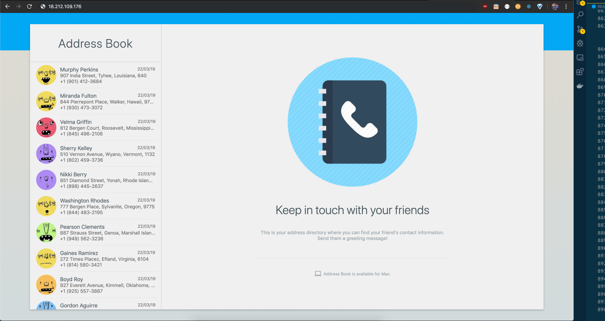

# Tutorial: Implement a Custom VPC with private and public subnets

This tutorial will teach you how to create a custom VPC from scratch and secure your backends services while keeping public services available for everyone.

## Architecture


## Workflow

There're two subnets inside the same Availability Zone (`AZ-1a`). `subnet-a` is public (has internet access) while `subnet-b` is private.

`subnet-a` is public because it has associated a Route Table which routes traffic from the subnet to the internet through the Internet Gateway (from `0.0.0.0/0` to IGW).

`subnet-b` is private because it does not have internet acces by its own, instead it uses a NAT Gateway (Network Address Translator). What the NAT Gateway does is, whenever an instance inside the private subnet wants to reach iternet, the traffic is routed to the NAT device, which acts imposter, lending it's public IP (Elastic IP) to reach internet through the IGW. When the response goes back, the NAT device route back it to the original requester. So, there's a Route Table associated with the `subnet-b` which makes it private, routing traffic that wants to reach internet to the NAT device (from `0.0.0.0/0` to NAT). Notice that the NAT Gateway must be inside the public subnet so it is able to hit internet.

And as you have already inferred, there's also an Internet Gateway attached to the VPC, enabling internet access.

There's an EC2 instance in the public subnet with a Server Side Rendered (SSR) React App, developed using [Next.js](https://nextjs.org/) which hits an API hosted in another EC2 inside the private subnet. This API only has one Endpoint to retrieve a static list of users.

## App Example



This is a non-functional frontend application which the only thing it does is request data from a API that returns static JSON and displays it in a good-looking way.

## Prerequisites

This tutorial asumes you have an AWS account and you've configured AWS credentials for CLI, if you haven't [please do so](https://docs.aws.amazon.com/cli/latest/userguide/cli-chap-install.html#post-install-configure).

I have configured the CLI to use the `us-east-1` region, so all the resources will be created in this region.

To follow the procedures in this tutorial you'll need a command line terminal to run commands. Commands are shown as below:

```
(bash) $ command
----------------
output
```

`(bash) $ ` is a constant indicating that is a command running in bash. Everything below `--------------` is the output of the command, or if the response is a JSON, it will have its own section denoted by **Output:** header.

> **IMPORTANT!** Make sure to replace ID parameters in all the AWS commands.

You can create a table like this one and have it at hand. It contains all the information you'll require throughout the course of this tutorial.

| Resource           | ID                           | Description
|--------------------|------------------------------|-------------------------
| VPC                | vpc-02e27819598ece690        | Custom VPC             |
| Subnet             | subnet-05a0d3cc0c4ec0216     | Public Subnet          |
| Subnet             | subnet-06ebb9352499f4bc5     | Private Subnet         |
| Internet Gateway   | igw-0527aad4095e242ca        | Internet Access        |
| Route Table        | rtb-0f2df4cfaea32bca7        | Public Route Table     |
| Route Table        | rtb-0c9e03e4587d8bbfb        | Private Route Table    |
| EC2 Instance       | i-008431283f3257b9c          | Frontend Instance      |
| EC2 instance       | i-03766f77e98b116a2          | Backend Instance       |
| Security Group     | sg-0a342975e64209e9c         | Public SG              |
| Security Group     | sg-0ada40a62aa532178         | Private SG             |
| User / Owner       | 436887685341                 | AWS Account ID         |
| Allocation         | eipalloc-08f11b4fabc07ae09   | Elastic IP Allocation  |
| NatGateway         | nat-005361e3d4f46f277        | NAT Gateway            |

## Creating a Custom VPC

A VPC is an isolated portion of the AWS cloud populated by AWS objects, such as Amazon EC2 instances. It is basically a network in the cloud. You must specify an IPv4 address range for your VPC. Specify the IPv4 address range as a Classless Inter-Domain Routing (CIDR) block; for example, 10.0.0.0/16. You cannot specify an IPv4 CIDR block larger than /16. You can optionally associate an Amazon-provided IPv6 CIDR block with the VPC.

```
create-vpc
  --cidr-block <value>
  [--amazon-provided-ipv6-cidr-block | --no-amazon-provided-ipv6-cidr-block]
  [--dry-run | --no-dry-run]
  [--instance-tenancy <value>]
  [--cli-input-json <value>]
  [--generate-cli-skeleton <value>]
```

```bash
(bash) $ aws ec2 create-vpc \
    --cidr-block 10.0.0.0/16
```

Output:

```json
{
  "Vpc": {
    "VpcId": "vpc-02e27819598ece690",
    "InstanceTenancy": "default",
    "Tags": [],
    "CidrBlockAssociationSet": [
      {
        "AssociationId": "vpc-cidr-assoc-0c584eccb4dc49679",
        "CidrBlock": "10.0.0.0/16",
        "CidrBlockState": {
          "State": "associated"
        }
      }
    ],
    "Ipv6CidrBlockAssociationSet": [],
    "State": "pending",
    "DhcpOptionsId": "dopt-0c363277",
    "OwnerId": "436887685341",
    "CidrBlock": "10.0.0.0/16",
    "IsDefault": false
  }
}
```

> When you create a VPC, also a Network Access Control List (NACL), a Security Group (SG) and a Route Table (RT) are created with default configurations.

## Creating subnets

A subnet us a portion of your network (your VPC).

In an on-premise architecture it is common to design subnets based on departments and functionalities (ie. finances, HR, marketing, each of them with its own subred).

But in cloud it's used to design according to what should be public and what private. Backend services should be isolated from internet and only enable access from known sources. By doing this we keep our services secure from unintended access.

When you create each subnet, you provide the VPC ID and IPv4 CIDR block for the subnet. After you create a subnet, you can't change its CIDR block. The size of the subnet's IPv4 CIDR block can be the same as a VPC's IPv4 CIDR block, or a subset of a VPC's IPv4 CIDR block. If you create more than one subnet in a VPC, the subnets' CIDR blocks must not overlap. The smallest IPv4 subnet (and VPC) you can create uses a /28 netmask (16 IPv4 addresses), and the largest uses a /16 netmask (65,536 IPv4 addresses).

If you add more than one subnet to a VPC, they're set up in a star topology with a logical router in the middle.

```
create-subnet
  [--availability-zone <value>]
  [--availability-zone-id <value>]
  --cidr-block <value>
  [--ipv6-cidr-block <value>]
  --vpc-id <value>
  [--dry-run | --no-dry-run]
  [--cli-input-json <value>]
  [--generate-cli-skeleton <value>]
```

```bash
(bash) $ aws ec2 create-subnet \
    --availability-zone us-east-1a \
    --vpc-id vpc-02e27819598ece690 \
    --cidr-block 10.0.1.0/24
```

Output:

```json
{
  "Subnet": {
    "MapPublicIpOnLaunch": false,
    "AvailabilityZoneId": "use1-az6",
    "AvailableIpAddressCount": 251,
    "DefaultForAz": false,
    "SubnetArn": "arn:aws:ec2:us-east-1:436887685341:subnet/subnet-05a0d3cc0c4ec0216",
    "Ipv6CidrBlockAssociationSet": [],
    "VpcId": "vpc-02e27819598ece690",
    "State": "pending",
    "AvailabilityZone": "us-east-1a",
    "SubnetId": "subnet-05a0d3cc0c4ec0216",
    "OwnerId": "436887685341",
    "CidrBlock": "10.0.1.0/24",
    "AssignIpv6AddressOnCreation": false
  }
}
```

```bash
(bash) $ aws ec2 create-subnet \
    --availability-zone us-east-1a \
    --vpc-id vpc-02e27819598ece690 \
    --cidr-block 10.0.2.0/24
```

Output:

```json
{
  "Subnet": {
    "MapPublicIpOnLaunch": false,
    "AvailabilityZoneId": "use1-az6",
    "AvailableIpAddressCount": 251,
    "DefaultForAz": false,
    "SubnetArn": "arn:aws:ec2:us-east-1:436887685341:subnet/subnet-06ebb9352499f4bc5",
    "Ipv6CidrBlockAssociationSet": [],
    "VpcId": "vpc-02e27819598ece690",
    "State": "pending",
    "AvailabilityZone": "us-east-1a",
    "SubnetId": "subnet-06ebb9352499f4bc5",
    "OwnerId": "436887685341",
    "CidrBlock": "10.0.2.0/24",
    "AssignIpv6AddressOnCreation": false
  }
}
```

Now we have two subnets created. By default they're private subnets because we haven't specified to route traffic to the internet, which we'll do in the Route Tables section.

> Notice that in both commands we are specifying `us-east-1a` as AZ. In case you're curious which AZs are available you can query them by typing `aws ec2 describe-availability-zones`.

## Create Internet Gateway

An internet gateway is a virtual router that connects a VPC to the internet.

```
create-internet-gateway
  [--dry-run | --no-dry-run]
  [--cli-input-json <value>]
  [--generate-cli-skeleton <value>]
```

```bash
(bash) $ aws ec2 create-internet-gateway
```

Output:

```json
{
  "InternetGateway": {
    "Tags": [],
    "Attachments": [],
    "InternetGatewayId": "igw-0527aad4095e242ca"
  }
}
```

### Attach IGW to VPC

The Internet Gateway has been created, but it is required to be assosiated to a VPC.

```
attach-internet-gateway
  [--dry-run | --no-dry-run]
  --internet-gateway-id <value>
  --vpc-id <value>
  [--cli-input-json <value>]
  [--generate-cli-skeleton <value>]
```

```bash
(bash) $ aws ec2 attach-internet-gateway \
    --internet-gateway-id igw-0527aad4095e242ca \
    --vpc-id vpc-02e27819598ece690
```

## Create Route Tables

Route Tables are created inside a VPC. A subnet always must be associated to a Route Table, and if you don't specify the route table it will be associated with the default Route Table created with the VPC.

What a Route Table does is cause that traffic originating from the subnet to be routed according to the routes in the route table.

So then we're going to create our own Route Tables, one for the public subnet and other for the private subnet.

```
create-route-table
  [--dry-run | --no-dry-run]
  --vpc-id <value>
  [--cli-input-json <value>]
  [--generate-cli-skeleton <value>]
```

Execute this command twice so you create two different Route Tables.

```bash
(bash) $ aws ec2 create-route-table --vpc-id vpc-02e27819598ece690
```

Output:

```json
{
  "RouteTable": {
    "Associations": [],
    "RouteTableId": "rtb-0f2df4cfaea32bca7",
    "VpcId": "vpc-02e27819598ece690",
    "PropagatingVgws": [],
    "Tags": [],
    "Routes": [
      {
        "GatewayId": "local",
        "DestinationCidrBlock": "10.0.0.0/16",
        "State": "active",
        "Origin": "CreateRouteTable"
      }
    ],
    "OwnerId": "436887685341"
  }
}
```

```json
{
  "RouteTable": {
    "Associations": [],
    "RouteTableId": "rtb-0c9e03e4587d8bbfb",
    "VpcId": "vpc-02e27819598ece690",
    "PropagatingVgws": [],
    "Tags": [],
    "Routes": [
      {
        "GatewayId": "local",
        "DestinationCidrBlock": "10.0.0.0/16",
        "State": "active",
        "Origin": "CreateRouteTable"
      }
    ],
    "OwnerId": "436887685341"
  }
}
```

* `rtb-0f2df4cfaea32bca7` will be associated with our public subnet (`subnet-05a0d3cc0c4ec0216`).
* `rtb-0c9e03e4587d8bbfb` will be associated with our private subnet (`subnet-06ebb9352499f4bc5`).

Also notice that when you create a Route Table it gets by default a Route which goes from `10.0.0.0/16` to `local`. And if you're paying attention the `from` block of IPs is the CIDR of the VPC.

What these route does is enable free traffic among instances belonging to the same VPC so that an EC2 instances in a subnet A is able to communicate to an EC2 instance in a subnet B.

### Make a subnet Public

As I mentioned before, both subnets are private because they only have a route that enables free traffic inside the VPC. In order to make a subnet a public one we must create a route that routes traffic from the subnet to the internet, and that's by using the Internet Gateway.

```
create-route
  [--destination-cidr-block <value>]
  [--destination-ipv6-cidr-block <value>]
  [--dry-run | --no-dry-run]
  [--egress-only-internet-gateway-id <value>]
  [--gateway-id <value>]
  [--instance-id <value>]
  [--nat-gateway-id <value>]
  [--transit-gateway-id <value>]
  [--network-interface-id <value>]
  --route-table-id <value>
  [--vpc-peering-connection-id <value>]
  [--cli-input-json <value>]
  [--generate-cli-skeleton <value>]
```

```bash
(bash) $ aws ec2 create-route \
    --route-table-id rtb-0f2df4cfaea32bca7 \
    --destination-cidr-block 0.0.0.0/0 \
    --gateway-id igw-0527aad4095e242ca
```

What this command does is "for the Route Table `rtb-0f2df4cfaea32bca7`, create a route that routes traffic from `0.0.0.0/0` to the Internet Gateway `igw-0527aad4095e242ca`". The `0.0.0.0/0` CIDR block  match all addresses in the IPv4 address space. In other words, every IP has access to the Internet.

### Associate Route Tables to Subnets

Now it's time to make our subnets public and private (both are private by default).

```
associate-route-table
  [--dry-run | --no-dry-run]
  --route-table-id <value>
  --subnet-id <value>
  [--cli-input-json <value>]
  [--generate-cli-skeleton <value>]
```

Associate the public Route Table to a Subnet.

```bash
(bash) $ aws ec2 associate-route-table \
    --route-table-id rtb-0f2df4cfaea32bca7 \
    --subnet-id subnet-05a0d3cc0c4ec0216
```

Output:

```json
{
  "AssociationId": "rtbassoc-0fd46a21be2e2f5b5"
}
```

Associate the private Route Table to the other subnet.

```bash
(bash) $ aws ec2 associate-route-table \
    --route-table-id rtb-0c9e03e4587d8bbfb \
    --subnet-id subnet-06ebb9352499f4bc5
```

Output:

```json
{
  "AssociationId": "rtbassoc-0e393eea6c2c31673"
}
```

## Run EC2 Instance for SSR Frontend

Now let's provision an EC2 instance for the frontend.

```
run-instances
  [--block-device-mappings <value>]
  [--image-id <value>]
  [--instance-type <value>]
  [--ipv6-address-count <value>]
  [--ipv6-addresses <value>]
  [--kernel-id <value>]
  [--key-name <value>]
  [--monitoring <value>]
  [--placement <value>]
  [--ramdisk-id <value>]
  [--security-group-ids <value>]
  [--security-groups <value>]
  [--subnet-id <value>]
  [--user-data <value>]
  [--additional-info <value>]
  [--client-token <value>]
  [--disable-api-termination | --enable-api-termination]
  [--dry-run | --no-dry-run]
  [--ebs-optimized | --no-ebs-optimized]
  [--iam-instance-profile <value>]
  [--instance-initiated-shutdown-behavior <value>]
  [--network-interfaces <value>]
  [--private-ip-address <value>]
  [--elastic-gpu-specification <value>]
  [--elastic-inference-accelerators <value>]
  [--tag-specifications <value>]
  [--launch-template <value>]
  [--instance-market-options <value>]
  [--credit-specification <value>]
  [--cpu-options <value>]
  [--capacity-reservation-specification <value>]
  [--hibernation-options <value>]
  [--license-specifications <value>]
  [--count <value>]
  [--secondary-private-ip-addresses <value>]
  [--secondary-private-ip-address-count <value>]
  [--associate-public-ip-address | --no-associate-public-ip-address]
  [--cli-input-json <value>]
  [--generate-cli-skeleton <value>]
```

```bash
(bash) $ aws ec2 run-instances \
    --image-id ami-0b69ea66ff7391e80 \
    --instance-type t2.micro \
    --subnet-id subnet-05a0d3cc0c4ec0216 \
    --user-data file://build/frontend.sh \
    --associate-public-ip-address
```

**Parameter description**:
* `--image-id`: refers to Amazon Linux 2.
* `--instance-type`: the size of the image (RAM, CPU...).
* `--subnet-id`: our public subnet ID.
* `--user-data`: a bootstrap script that will run after the instance is provisioned.
* `--associate-public-ip-address`: by default when you create a VPC all instances created inside it doesn't get public IPs, you have to do other configurations about DHCP to make it happen. But for now we can add this argument to instruct AWS to assign a public IP.

Output:

```json
{
  "Instances": [
    {
      "Monitoring": {
        "State": "disabled"
      },
      "PublicDnsName": "",
      "StateReason": {
        "Message": "pending",
        "Code": "pending"
      },
      "State": {
        "Code": 0,
        "Name": "pending"
      },
      "EbsOptimized": false,
      "LaunchTime": "2019-10-01T17:45:04.000Z",
      "PrivateIpAddress": "10.0.1.147",
      "ProductCodes": [],
      "VpcId": "vpc-02e27819598ece690",
      "CpuOptions": {
        "CoreCount": 1,
        "ThreadsPerCore": 1
      },
      "StateTransitionReason": "",
      "InstanceId": "i-008431283f3257b9c",
      "ImageId": "ami-0b69ea66ff7391e80",
      "PrivateDnsName": "ip-10-0-1-147.ec2.internal",
      "SecurityGroups": [
        {
          "GroupName": "default",
          "GroupId": "sg-0019f4fdcc4abd73b"
        }
      ],
      "ClientToken": "",
      "SubnetId": "subnet-05a0d3cc0c4ec0216",
      "InstanceType": "t2.micro",
      "CapacityReservationSpecification": {
        "CapacityReservationPreference": "open"
      },
      "NetworkInterfaces": [
        {
          "Status": "in-use",
          "MacAddress": "0e:f9:cc:7c:a0:34",
          "SourceDestCheck": true,
          "VpcId": "vpc-02e27819598ece690",
          "Description": "",
          "NetworkInterfaceId": "eni-02b32a003193ef83b",
          "PrivateIpAddresses": [
            {
              "Primary": true,
              "PrivateIpAddress": "10.0.1.147"
            }
          ],
          "SubnetId": "subnet-05a0d3cc0c4ec0216",
          "InterfaceType": "interface",
          "Attachment": {
            "Status": "attaching",
            "DeviceIndex": 0,
            "DeleteOnTermination": true,
            "AttachmentId": "eni-attach-05d1d1ca2102c2d87",
            "AttachTime": "2019-10-01T17:45:04.000Z"
          },
          "Groups": [
            {
              "GroupName": "default",
              "GroupId": "sg-0019f4fdcc4abd73b"
            }
          ],
          "Ipv6Addresses": [],
          "OwnerId": "436887685341",
          "PrivateIpAddress": "10.0.1.147"
        }
      ],
      "SourceDestCheck": true,
      "Placement": {
        "Tenancy": "default",
        "GroupName": "",
        "AvailabilityZone": "us-east-1a"
      },
      "Hypervisor": "xen",
      "BlockDeviceMappings": [],
      "Architecture": "x86_64",
      "RootDeviceType": "ebs",
      "RootDeviceName": "/dev/xvda",
      "VirtualizationType": "hvm",
      "AmiLaunchIndex": 0
    }
  ],
  "ReservationId": "r-025b2b670f3ebdc85",
  "Groups": [],
  "OwnerId": "436887685341"
}
```

Wait about 5 minutes so the bootstrap script have time to install the required software for the frontend app (Node.js, Nginx, download the source code of the frontend, build it and run the application).

Now let's test our frontend app. You have to look up for the public IP address, which is not in the response of the `run-instances` command because it takes a moment to be assigned by AWS. So give it one or two minutes to describe the instance and look for it:

```bash
(bash) $ aws ec2 describe-instances \
    --instance-ids i-008431283f3257b9c
```

The response it's almost the same as `run-instances` but this time with the public IP. Copy and paste in in your favorite browser.

You'll notice that nothing happens. That's because of the firewall.

We have two virtual firewalls available on AWS (whithout counting AWS WAF):

* **Security Groups (SGs)**: lets you define firewall rules at instance level.
* **Network Access Control List (NACLs)**: lets you define firewall riles at subnet level.

What a Firewall does is let traffic going in and out. You can specify rules at Port, Protocol and Source levels. For example, enable HTTP access on port 80 from anywhere; enable SSH access on port 22 from your IP; etc.

You can create a SG and use it for all your instances in your subnet, or create a NACL with the same rules and all the instances inside the subnet will inherit those rules.

And which of them should I use? Well, when you have common rules that applies to all the instances inside your subnet you could use a NACL, but if you require different rulles for group of instances then you can create SGs with those set of rules and assign according your needs. But in some use cases you can achieve the same goal with one or the other.

As I mentioned when we created the VPC, default NACL and SG got created. They have predefined rules, first see the SG.

```bash
(bash) $ aws ec2 describe-security-groups \
    --filters Name=vpc-id,Values=vpc-02e27819598ece690
```

Output:

```json
{
  "SecurityGroups": [
    {
      "IpPermissionsEgress": [
        {
          "IpProtocol": "-1",
          "PrefixListIds": [],
          "IpRanges": [
            {
              "CidrIp": "0.0.0.0/0"
            }
          ],
          "UserIdGroupPairs": [],
          "Ipv6Ranges": []
        }
      ],
      "Description": "default VPC security group",
      "IpPermissions": [
        {
          "IpProtocol": "-1",
          "PrefixListIds": [],
          "IpRanges": [],
          "UserIdGroupPairs": [
            {
              "UserId": "436887685341",
              "GroupId": "sg-0019f4fdcc4abd73b"
            }
          ],
          "Ipv6Ranges": []
        }
      ],
      "GroupName": "default",
      "VpcId": "vpc-02e27819598ece690",
      "OwnerId": "436887685341",
      "GroupId": "sg-0019f4fdcc4abd73b"
    }
  ]
}
```

In the response we can see two important fields: `IpPermissions` and `IpPermissionsEgress`, the first one for `Inbound` rules and the second for `Outbound` rules.

As you can see in `IpPermissionsEgress` we have one rule: `IpProtocol: "-1"` refers to any protocol and `IpRanges.[0].CidrIp: "0.0.0.0/0"` refers to any IP, in other whords, all traffic from anywhere.

That's not the case for `IpPermissions` (inbound rules). We also have any protocol, but it doesn't have specified any IpRanges, otherwise it specifies `UserIdGroupPairs`, where whe have the `GroupId` `sg-0019f4fdcc4abd73b`, which is itself. And what does that mean? Well, there can only be communication between instances with the same security group. That does not work for us, because we require to receive traffic from anywhere in our public instances.

We could change the rules for the default SG, but that's not a good practice, because this SG is assigned by default to any instance that does not get specified a SG and if we do that by default all instances will be reachable via internet, which sometimes that's not what we want.

Now let's take a look to our NACL:

```bash
(bash) $ aws ec2 describe-network-acls \
    --filters Name=vpc-id,Values=vpc-02e27819598ece690
```

Output:

```json
{
  "NetworkAcls": [
    {
      "Associations": [
        {
          "SubnetId": "subnet-06ebb9352499f4bc5",
          "NetworkAclId": "acl-0d0f3e158d4a12c02",
          "NetworkAclAssociationId": "aclassoc-0fb727289ce20d8b8"
        },
        {
          "SubnetId": "subnet-05a0d3cc0c4ec0216",
          "NetworkAclId": "acl-0d0f3e158d4a12c02",
          "NetworkAclAssociationId": "aclassoc-0c53e265482b2494e"
        }
      ],
      "NetworkAclId": "acl-0d0f3e158d4a12c02",
      "VpcId": "vpc-02e27819598ece690",
      "Tags": [],
      "Entries": [
        {
          "RuleNumber": 100,
          "Protocol": "-1",
          "Egress": true,
          "CidrBlock": "0.0.0.0/0",
          "RuleAction": "allow"
        },
        {
          "RuleNumber": 32767,
          "Protocol": "-1",
          "Egress": true,
          "CidrBlock": "0.0.0.0/0",
          "RuleAction": "deny"
        },
        {
          "RuleNumber": 100,
          "Protocol": "-1",
          "Egress": false,
          "CidrBlock": "0.0.0.0/0",
          "RuleAction": "allow"
        },
        {
          "RuleNumber": 32767,
          "Protocol": "-1",
          "Egress": false,
          "CidrBlock": "0.0.0.0/0",
          "RuleAction": "deny"
        }
      ],
      "OwnerId": "436887685341",
      "IsDefault": true
    }
  ]
}
```

The first thing to notice here is that this NACL is assigned (`Associations`) to our two subnets. It was assigned by default.

Then in the `Entries` array we have four entries: two with `"Egress": true` and two with `"Egress": false`. That is two are Outbound rules and the other two Inbound rules.

All the rules has `"Protocol": "-1"` and `"CidrBlock": "0.0.0.0/0"` which means all traffic from/to anywhere.

The Inboud rules (`"Egress": false`) has a rule that `allow` with a `RuleNumber` of `100`, and other rule that `deny` with a `RuleNumber` of `32767`*.

Rules are applied from lower `RuleNumber` to higer. In this case, first allow (`RuleAction`) all traffic (`Protocol`) from anywhere (`CidrBlock`) (it is an inbound rule), and then deny all traffic from anywhere. As rules are applied from lower to higher, a higer rule can't contradict a lower rule. In other words, a rule that contradicts another is ignored, the first rule is applied, the second one don't. This is the same for Outbound rules.

This `RuleAction` numbers allow you to allow, for example, HTTP traffic from anywhere, and then all other protocols are denied. Everything that is not specified explicitly is denied by defaul.

Now we know what NACLs and Security Groups are for and understand that our EC2 instance is not reachable because it is only accessible from other instances with the same SG, we can start fixing it.

### Create a Public accessible SG

We want to allow HTTP traffic not only from other instance with the same SG but from anywhere.

**Inbound Rules**

Type  | Protocol | Port | Destination | Description
------|----------|------|-------------|---------------------------
HTTP  | TCP      | 80   | 0.0.0.0/0   | Allow HTTP from anywhere |

**Outbound Rules**

Type  | Protocol | Port | Destination | Description
------|----------|------|-------------|-----------------------------------------------
HTTP  | TCP      | 80   | 0.0.0.0/0   | Allow HTTP to download software and updates  |
HTTPS | TCP      | 443  | 0.0.0.0/0   | Allow HTTPS to download software and updates |

First we create the SG:

```
create-security-group
  --description <value>
  --group-name <value>
  [--vpc-id <value>]
  [--dry-run | --no-dry-run]
  [--cli-input-json <value>]
  [--generate-cli-skeleton <value>]
```

```bash
(bash) $ aws ec2 create-security-group \
    --group-name public-http \
    --vpc-id vpc-02e27819598ece690 \
    --description "SG that will be assigned to Public Instances for HTTP"
```

Output:

```json
{
  "GroupId": "sg-0a342975e64209e9c"
}
```

You can verify which rules where assigned to this SG:

```bash
(bash) $ aws ec2 describe-security-groups \
    --filters Name=vpc-id,Values=vpc-02e27819598ece690,Name=group-name,Values=public-http
```

Output:

```json
{
  "SecurityGroups": [
    {
      "IpPermissionsEgress": [
        {
          "IpProtocol": "-1",
          "PrefixListIds": [],
          "IpRanges": [
            {
              "CidrIp": "0.0.0.0/0"
            }
          ],
          "UserIdGroupPairs": [],
          "Ipv6Ranges": []
        }
      ],
      "Description": "SG that will be assigned to Public Instances for HTTP",
      "IpPermissions": [],
      "GroupName": "public-http",
      "VpcId": "vpc-02e27819598ece690",
      "OwnerId": "436887685341",
      "GroupId": "sg-0a342975e64209e9c"
    }
  ]
}
```

There's no inbound rules (`IpPermissions`) and it allows all traffic to anywhere (`IpPermissionsEgress`).

We want to allow `HTTP` **FROM** anywhere and `HTTP/HTTPS` **TO** anywhere.

First let's revoke the outbound rule that doesn't work for us:

```
(bash) $ aws ec2 revoke-security-group-egress \
    --group-id sg-0a342975e64209e9c \
    --ip-permissions '[{ "IpProtocol": "-1", "IpRanges": [{ "CidrIp": "0.0.0.0/0" }] }]'
```

If you wish you can query again the SG to verify outbound permissions where revoked.

Now let's allow Inbound rules for HTTP:

```
(bash) $ aws ec2 authorize-security-group-ingress \
    --group-id sg-0a342975e64209e9c \
    --ip-permissions '[{ "IpProtocol": "tcp", "FromPort": 80, "ToPort": 80, "IpRanges": [{ "CidrIp": "0.0.0.0/0", "Description": "Allow HTTP from anywhere" }] }]'
```

Now let's allow Outbound rules for HTTP:

```
(bash) $ aws ec2 authorize-security-group-egress \
    --group-id sg-0a342975e64209e9c \
    --ip-permissions '[{ "IpProtocol": "tcp", "FromPort": 80, "ToPort": 80, "IpRanges": [{ "CidrIp": "0.0.0.0/0", "Description": "Allow HTTP to download software and updates" }] }]'
```

And now for HTTPS:

```
(bash) $ aws ec2 authorize-security-group-egress \
    --group-id sg-0a342975e64209e9c \
    --ip-permissions '[{ "IpProtocol": "tcp", "FromPort": 443, "ToPort": 443, "IpRanges": [{ "CidrIp": "0.0.0.0/0", "Description": "Allow HTTPS to download software and updates" }] }]'
```

The reason we need HTTPS traffic is because we are downloading code from Github in the bootstrap script for EC2 instances with `wget`, which makes an HTTPS request (Although it is no longer necessary due to the software was already installed. The default security group has access to anywhere with all protocols).

Now that we have a SG that works for our use case we need to update our running EC2 instance to remove the default SG and assign the one we just have created.

```
modify-instance-attribute
  [--source-dest-check | --no-source-dest-check]
  [--attribute <value>]
  [--block-device-mappings <value>]
  [--disable-api-termination | --no-disable-api-termination]
  [--dry-run | --no-dry-run]
  [--ebs-optimized | --no-ebs-optimized]
  [--ena-support | --no-ena-support]
  [--groups <value>]
  --instance-id <value>
  [--instance-initiated-shutdown-behavior <value>]
  [--instance-type <value>]
  [--kernel <value>]
  [--ramdisk <value>]
  [--sriov-net-support <value>]
  [--user-data <value>]
  [--value <value>]
  [--cli-input-json <value>]
  [--generate-cli-skeleton <value>]
```

```bash
(bash) $ aws ec2 modify-instance-attribute \
    --instance-id i-008431283f3257b9c \
    --groups sg-0a342975e64209e9c
```

Now try again to hit your EC2's public IP, you should be able to see the frontend app. It could take around five seconds to load the page (an HTTP request is made to the backend app which is not provisioned yet). If you don't verify again what have you done and try to figure out by yourself what is going on. Trust me, it will give you a lot of experience.


Notice that we've got an error with the user list. That's because we  don't have the backend instance configured yet.

## Run EC2 Instance for Backend service

If we create an instance like we did for the frontend, without specifying a SG the default one will be assigned but our frontend instance won't be able to reach the backend one. So first we need to create another SG for this instance. We could use the public one but this allows traffic from anywhere, and for security concerns and good practices we should only allow trust sources.

### Create SG for Backend Instance

For this SG we'll allow inbound traffic comming from the public SG and allow HTTP and HTTPS as outbound. The Backend instance also download code from Github, so we need HTTPS as well.

**Inbound Rules**

Type  | Protocol | Port | Destination | Description
------|----------|------|-------------|----------------------------
HTTP  | TCP      | 80   | 0.0.0.0/0   | Allow HTTP from public-sg |

**Outbound Rules**

Type  | Protocol | Port | Destination | Description
------|----------|------|-------------|-----------------------------------------------
HTTP  | TCP      | 80   | 0.0.0.0/0   | Allow HTTP to download software and updates  |
HTTPS | TCP      | 443  | 0.0.0.0/0   | Allow HTTPS to download software and updates |

```bash
(bash) $ aws ec2 create-security-group \
    --group-name private-http \
    --vpc-id vpc-02e27819598ece690 \
    --description "SG that will be assigned to Private instances for HTTP"
```

Output:

```json
{
  "GroupId": "sg-0ada40a62aa532178"
}
```

First let's revoke the default outbound rule:

```bash
(bash) $ aws ec2 revoke-security-group-egress \
    --group-id sg-0ada40a62aa532178 \
    --ip-permissions '[{ "IpProtocol": "-1", "IpRanges": [{ "CidrIp": "0.0.0.0/0" }] }]'
```

Now let's add our inboud rules. Remember that we only will allow incomming HTTP traffic from the public SG.

> If you don't have at hand the SG ids you can query them by typing `aws ec2 describe-security-groups --filters Name=vpc-id,Values=vpc-02e27819598ece690`. Remember to replace the `vpc-id` by your own.

* Public SG: `sg-0a342975e64209e9c`
* Private SG: `sg-0ada40a62aa532178`

```bash
(bash) $ aws ec2 authorize-security-group-ingress \
  --group-id sg-0ada40a62aa532178 \
  --ip-permissions '[{ "IpProtocol": "tcp", "FromPort": 80, "ToPort": 80, "UserIdGroupPairs": [{ "UserId": "436887685341", "GroupId": "sg-0a342975e64209e9c" }] }]'
```

This is a slightly different rule from the previous we have been seeing. Instead of `IpRanges` now we are using `UserIdGroupPairs`.This is how we allow inbound traffic from other SG. `UserId` refers to your account ID, you can get it by querying security groups and look in the `OwnerId` field. `GroupId` is the Security Group ID that you want to allow as inbound/egress. In our case the public SG.

Now lets allow outbound traffic for HTTP and HTTPS. This is the same than the public SG.

```bash
(bash) $ aws ec2 authorize-security-group-egress \
    --group-id sg-0ada40a62aa532178 \
    --ip-permissions '[{ "IpProtocol": "tcp", "FromPort": 80, "ToPort": 80, "IpRanges": [{ "CidrIp": "0.0.0.0/0", "Description": "Allow HTTP traffic to anywhere" }] }]'
```

```bash
(bash) $ aws ec2 authorize-security-group-egress \
    --group-id sg-0ada40a62aa532178 \
    --ip-permissions '[{ "IpProtocol": "tcp", "FromPort": 443, "ToPort": 443, "IpRanges": [{ "CidrIp": "0.0.0.0/0", "Description": "Allow HTTPS traffic to anywhere" }] }]'
```

Our Security Group should look like this:

```bash
(bash) $ aws ec2 describe-security-groups \
    --group-id sg-0ada40a62aa532178
```

```json
{
  "SecurityGroups": [
    {
      "IpPermissionsEgress": [
        {
          "PrefixListIds": [],
          "FromPort": 80,
          "IpRanges": [
            {
              "Description": "Allow HTTP traffic to anywhere",
              "CidrIp": "0.0.0.0/0"
            }
          ],
          "ToPort": 80,
          "IpProtocol": "tcp",
          "UserIdGroupPairs": [],
          "Ipv6Ranges": []
        },
        {
          "PrefixListIds": [],
          "FromPort": 443,
          "IpRanges": [
            {
              "Description": "Allow HTTPS traffic to anywhere",
              "CidrIp": "0.0.0.0/0"
            }
          ],
          "ToPort": 443,
          "IpProtocol": "tcp",
          "UserIdGroupPairs": [],
          "Ipv6Ranges": []
        }
      ],
      "Description": "SG that will be assigned to Private instances for HTTP",
      "IpPermissions": [
        {
          "PrefixListIds": [],
          "FromPort": 80,
          "IpRanges": [],
          "ToPort": 80,
          "IpProtocol": "tcp",
          "UserIdGroupPairs": [
            {
              "UserId": "436887685341",
              "GroupId": "sg-0a342975e64209e9c"
            }
          ],
          "Ipv6Ranges": []
        }
      ],
      "GroupName": "private-http",
      "VpcId": "vpc-02e27819598ece690",
      "OwnerId": "436887685341",
      "GroupId": "sg-0ada40a62aa532178"
    }
  ]
}
```

If we try to run the backend instance in this time it will fail because it doesn't have access to internet yet, which is required to download the project code and to install all the required software.

So first lets add internet access to our private subnet.

### Enable outbound internet access to Private subnet

This will allow our instances in the private subnet to reach internet to download software, updates and patches but they won't be publicly accessible. This is an unidirectional internet access, allow from inside to outside but not the other way.

To doing so we require to do three things:

* Allocate an Elastic IP,
* Create a NAT Gateway, and
* Route traffic from any IP of the private subnet to the NAT Gateway.

First lets see what an Elastic IP is. When you run an EC2 Instance in the default VPC, AWS assigns a Public IP from an IP pool. If you terminate your instance and run other you'll have a different IP. Those IP from the pool are reused for different resources, so the chance you get the same IP is quite low. The same happen when you stop and start the same instance: the public IP always changes. And here's where Elastic IPs come for the rescue. Once an Elastic IP is allocated, it got a public IP which will remain the same while it is allocated in your account. You can have up to 5 Elastic IPs per region, but this limit can be increased by raising a ticket to AWS.

> To ensure efficient use of Elastic IP addresses, AWS impose a small hourly charge when these IP addresses are not associated with a running instance or when they are associated with a stopped instance or unattached network interface.

#### Allocate an Elastic IP

```bash
(bash) $ aws ec2 allocate-address --domain vpc
```

Output:

```json
{
  "PublicIp": "52.86.251.146",
  "Domain": "vpc",
  "AllocationId": "eipalloc-08f11b4fabc07ae09",
  "PublicIpv4Pool": "amazon"
}
```

#### Create a NAT Gateway

```bash
(bash) $ aws ec2 create-nat-gateway \
    --allocation-id eipalloc-08f11b4fabc07ae09 \
    --subnet-id subnet-05a0d3cc0c4ec0216
```

Output:

```json
{
  "NatGateway": {
    "NatGatewayAddresses": [
      {
        "AllocationId": "eipalloc-08f11b4fabc07ae09"
      }
    ],
    "VpcId": "vpc-02e27819598ece690",
    "State": "pending",
    "NatGatewayId": "nat-005361e3d4f46f277",
    "SubnetId": "subnet-05a0d3cc0c4ec0216",
    "CreateTime": "2019-10-01T19:55:08.000Z"
  }
}
```

#### Create Route in Private Route Table to route public traffic to NAT Gateway

```bash
(bash) $ aws ec2 create-route \
    --route-table-id rtb-0c9e03e4587d8bbfb \
    --destination-cidr-block 0.0.0.0/0 \
    --nat-gateway-id nat-005361e3d4f46f277
```

Output:

```json
{
  "Return": true
}
```

### Run Backend EC2 Instance

Now that everything is configured we can run our instance in the private subnet using the `backend` bootstrap script. Once we run it we must wait a couple of minutes so the bootstrap script install all the required software and set up the API.

```bash
(bash) $ aws ec2 run-instances \
    --image-id ami-0b69ea66ff7391e80 \
    --instance-type t2.micro \
    --security-group-ids sg-0ada40a62aa532178 \
    --subnet-id subnet-06ebb9352499f4bc5 \
    --user-data file://build/backend.sh \
    --private-ip-address 10.0.2.224 \
    --key-name MyNewKeyPair | jq '.'
```

Output:

```json
{
  "Instances": [
    {
      "Monitoring": {
        "State": "disabled"
      },
      "PublicDnsName": "",
      "StateReason": {
        "Message": "pending",
        "Code": "pending"
      },
      "State": {
        "Code": 0,
        "Name": "pending"
      },
      "EbsOptimized": false,
      "LaunchTime": "2019-10-01T19:57:48.000Z",
      "PrivateIpAddress": "10.0.2.224",
      "ProductCodes": [],
      "VpcId": "vpc-02e27819598ece690",
      "CpuOptions": {
        "CoreCount": 1,
        "ThreadsPerCore": 1
      },
      "StateTransitionReason": "",
      "InstanceId": "i-03766f77e98b116a2",
      "ImageId": "ami-0b69ea66ff7391e80",
      "PrivateDnsName": "ip-10-0-2-224.ec2.internal",
      "SecurityGroups": [
        {
          "GroupName": "private-http",
          "GroupId": "sg-0ada40a62aa532178"
        }
      ],
      "ClientToken": "",
      "SubnetId": "subnet-06ebb9352499f4bc5",
      "InstanceType": "t2.micro",
      "CapacityReservationSpecification": {
        "CapacityReservationPreference": "open"
      },
      "NetworkInterfaces": [
        {
          "Status": "in-use",
          "MacAddress": "0e:fb:89:1b:0a:b2",
          "SourceDestCheck": true,
          "VpcId": "vpc-02e27819598ece690",
          "Description": "",
          "NetworkInterfaceId": "eni-0512a7e98280c3862",
          "PrivateIpAddresses": [
            {
              "Primary": true,
              "PrivateIpAddress": "10.0.2.224"
            }
          ],
          "SubnetId": "subnet-06ebb9352499f4bc5",
          "InterfaceType": "interface",
          "Attachment": {
            "Status": "attaching",
            "DeviceIndex": 0,
            "DeleteOnTermination": true,
            "AttachmentId": "eni-attach-00b9ca49782db79e8",
            "AttachTime": "2019-10-01T19:57:48.000Z"
          },
          "Groups": [
            {
              "GroupName": "private-http",
              "GroupId": "sg-0ada40a62aa532178"
            }
          ],
          "Ipv6Addresses": [],
          "OwnerId": "436887685341",
          "PrivateIpAddress": "10.0.2.224"
        }
      ],
      "SourceDestCheck": true,
      "Placement": {
        "Tenancy": "default",
        "GroupName": "",
        "AvailabilityZone": "us-east-1a"
      },
      "Hypervisor": "xen",
      "BlockDeviceMappings": [],
      "Architecture": "x86_64",
      "RootDeviceType": "ebs",
      "RootDeviceName": "/dev/xvda",
      "VirtualizationType": "hvm",
      "AmiLaunchIndex": 0
    }
  ],
  "ReservationId": "r-0eaa46a2a5849f392",
  "Groups": [],
  "OwnerId": "436887685341"
}
```

Wait for a couple of minutes while the bootstrap script install the software and the backend application (around five minutes) and the reload the frontend app. You should see something like this:


## Delete provisioned resources

### Terminate EC2 Instances

```bash
(bash) $ aws ec2 terminate-instances \
    --instance-ids i-008431283f3257b9c i-03766f77e98b116a2
```

Output:

```json
{
  "TerminatingInstances": [
    {
      "InstanceId": "i-03766f77e98b116a2",
      "CurrentState": {
        "Code": 32,
        "Name": "shutting-down"
      },
      "PreviousState": {
        "Code": 16,
        "Name": "running"
      }
    },
    {
      "InstanceId": "i-008431283f3257b9c",
      "CurrentState": {
        "Code": 32,
        "Name": "shutting-down"
      },
      "PreviousState": {
        "Code": 16,
        "Name": "running"
      }
    }
  ]
}
```

### Delete NAT Gateway

```bash
(bash) $ aws ec2 delete-nat-gateway \
    --nat-gateway-id nat-005361e3d4f46f277
```

Output:

```json
{
  "NatGatewayId": "nat-005361e3d4f46f277"
}
```

### Release Elastic IP

```bash
(bash) $ aws ec2 release-address \
    --allocation-id eipalloc-08f11b4fabc07ae09
```

### Delete Subnets

```bash
(bash) $ aws ec2 delete-subnet \
    --subnet-id subnet-05a0d3cc0c4ec0216
```

```bash
(bash) $ aws ec2 delete-subnet \
    --subnet-id subnet-06ebb9352499f4bc5
```

### Delete Route Tables

```bash
(bash) $ aws ec2 delete-route-table \
    --route-table-id rtb-0f2df4cfaea32bca7
```

```bash
(bash) $ aws ec2 delete-route-table \
    --route-table-id rtb-0c9e03e4587d8bbfb
```

### Delete Security Groups

```bash
(bash) $ aws ec2 delete-security-group \
    --group-id sg-0ada40a62aa532178
```

```bash
(bash) $ aws ec2 delete-security-group \
    --group-id sg-0a342975e64209e9c
```

### Detach Internet Gateway

```bash
(bash) $ aws ec2 detach-internet-gateway \
    --internet-gateway-id igw-0527aad4095e242ca \
    --vpc-id vpc-02e27819598ece690
```

### Delete Internet Gateway

```bash
(bash) $ aws ec2 delete-internet-gateway \
    --internet-gateway-id igw-0527aad4095e242ca
```

### Delete VPC

```bash
(bash) $ aws ec2 delete-vpc \
    --vpc-id vpc-02e27819598ece690
```
